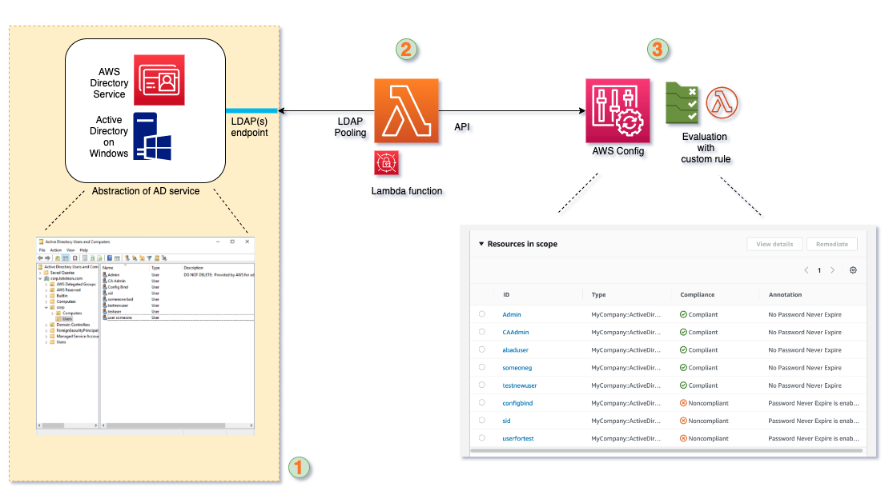

# Introduction

AWS Config is a service for managing configuration and compliance status of AWS resources. It is a cloud-native solution for you to track the historical state of the configuration of a resource and verify its compliance against policies and best practices. I have worked with multiple enterprise customers of AWS, and AWS Config has been proven to be a very good solution for building a serverless system that governs your resources.

There are many benefits in using AWS Config to build an integrated resource governance system with monitoring, alerting, auto-remediation. AWS Config was originally created to watch and govern the configuration of native AWS resources such as Amazon EC2 instances, Amazon S3 buckets and so on. But with the launch of this exciting [new feature](https://aws.amazon.com/about-aws/whats-new/2019/11/aws-config-launches-support-third-party-resources/), you can now extend the power of AWS Config to any resources that you want to govern, in any environment.

This blogpost demonstrates a solution that uses AWS Config to track the configuration state of users in a Windows Active Directory and verify it against polices (i.e. Config rules) for governance purposes.


# Overview 

This is a diagram of the overall workflow:



1. Assuming you already have a directory service running with an LDAP or LDAPs endpoint. It doesn't matter where you are hosting the directory service, the solution will work as long as it has an LDAP interface for Lambda. In my environment for testing, I used AWS Managed Microsoft AD with a network load balancer in front of the LDAP endpoints. The solution would work generically for the directory services running on EC2, on-premise or even other cloud providers.

2. A Lambda function that periodically pools data from the directory service via LDAP queries. AWS Secrets Manager is used to provide service account credentials for LDAP querying. The Lambda function will then map the attributes of AD users to a custom resource type in Config with a pre-defined schema. There will be detailed explanations in the following sections regarding how to create the custom resource type and the schema that I used.

3. AWS Config tracks the configuration state of the custom resources like how it works for an EC2 instance. In this example, you will be able to view the configuration state for each AD user in the AWS Config timeline. The data will also be archived with normal configuration snapshots for historical auditing. Then, I created a Config rule with simple Lambda functions to evaluate the AD users. In my case, it will report non-compliant when an AD user has the "password never expire" flag set to true.

---

# Quick setup

This repo contains automation scripts for easily setting up the components in your environment.
https://github.com/totoleon/aws-config-ad-connector.git.

### Prerequists

#### Directory Service with LDAP
To deploy the demo app, you should already have a running directory service with LDAP or LDAPs endpoint enabled. The Lambda function will need connectivity to the LDAP endpoint. In the demo, we are not launching the Lambda function in any VPC. If your directory service endpoint is in private subnets, you need to modify the app to place the Lambda function in the VPC or create a internet-facing Network Load Balancer for the LDAP endpoints. If you don't have a directoty service yet, you can quickly setup one with [AWS Managed Microsoft AD](https://docs.aws.amazon.com/directoryservice/latest/admin-guide/directory_microsoft_ad.html).

#### Local runtime requirements 
- `virtualenv` - We will use `virtualenv` on python3.6+ to manage python packages and runtime -  [Doc](https://virtualenv.pypa.io/en/latest/).
- `mvn` - This is needed as we will be using Java plugin for CloudFormation CLI when building our custom resource.
- `awscli` - We will neen AWS CLI and local credentials to deploy resources. [Setup guide](https://docs.aws.amazon.com/cli/latest/userguide/cli-chap-configure.html)
- `cdk` - We will use AWS CDK to orchestrate resources. AWS CDK can be easily installed using `npm install -g aws-cdk` with Node.js (>= 10.3.0). Please see more details [here](https://docs.aws.amazon.com/cdk/latest/guide/getting_started.html)

#### AWS environment
- We will create a Config rule for AD user evaluation, so please make sure that you have AWS Config enabled in the working region. [Setup guide](https://aws.amazon.com/config/getting-started/) 
- The Lambda function will need a service account from AD to be used as the bind user. In your active directory, create a user that will be used as bind user for our Lambda function. Goto AWS Secrets Manager, create a new secret using type Other type of secrets. In JSON filed type this:
```
{
  "bindusername": "<SERVICE_ACCOUNT_USERNAME_HERE>",
  "bindpassword": "<SERVICE_ACCOUNT_PASSWORD_HERE>"
}
```

For more instruction of using AWS Secret Manager, please see this [guide](https://aws.amazon.com/secrets-manager/getting-started/).

### Deploy

- Clone the repo:
`https://github.com/totoleon/aws-config-ad-connector.git`
Enter the directory 
`cd aws-config-ad-connector`

- Fill the variables in `env.sh.template` and rename it into `env.sh`

- `sh deploy.sh`

### Test

Go to Config rule "ADUserEvaluation", have a check of the resources in scope. Now if you create/delete/modify users from AD, it should be reflected in AWS Config in near real time.

- Log in to the Windows sever to make some changes on AD users
- The Config Rule report should show which users have "password never expire" flag set.


- Change user's "password never expire" flag will in Windows and it will be refelcted in the compliance status. (The refresh delay is up to 1 minute)

- You can also view the change and compliance in a timeline in the resource view.


You can try extend the Schema and evaluation logic to have more fun.

---

# Desgin details
### Workflow
The workflow and code are straightforward - The connector funtion pools user information from AD via LDAP and update resource status in AWS Config, where a custom rule will evaluate their compliance status.


### Resource orchestration
We will use AWS CDK to orchestrate resources in your AWS environment. AWS CDK is a software development framework for defining cloud infrastructure in code and provisioning it through AWS CloudFormation.

---

# Development
### Create CloudFormation custom resource type
In our example, we use `cloudformation-cli` and `cloudformation-cli-java-plugin` 

The CloudFormation CLI (cfn) allows you to author your own resource providers that can be used by CloudFormation. The plugin library helps to provide Java runtime bindings for the execution of your providers by CloudFormation. 
https://github.com/aws-cloudformation/aws-cloudformation-rpdk 
https://github.com/aws-cloudformation/aws-cloudformation-rpdk-java-plugin

The manual build steps are basically the same as what we have in `deploy.sh`

```
mkdir ADUserType && cd ADUserType
cfn init
```
Next you should see something that looks like this:
```
Initializing new project
What's the name of your resource type?
(Organization::Service::Resource)
>>
```
Let’s add in our type name `MyCompany::ActiveDirectory::User`.

Now let's modify the schema file in JSON 
```
{
    "typeName": "MyCompany::ActiveDirectory::User",
    "description": "Users in ActiveDirectory",
    "properties": {
        "SAMAccountName": {
            "type": "string"
        },
        "Name": {
            "type": "string"
        },
        "PwdLastSet": {
            "type": "string"
        },
        "userAccountControl": {
            "type": "string"
        }
    },
    "primaryIdentifier": [
        "/properties/SAMAccountName"
    ],
    "required": [
        "SAMAccountName"
    ],
    "additionalProperties": false
}
```
In this schema, there are four attributes that we want to get from the directory service:
- `SAMAccountName`: This is the user's unique login ID, which will be used as primary identifier in our custom resource type
- `Name`: This is the full name of the user
- `PwdLastSet`: This is the timestamp the last time if user reseting the password. This can be useful if you need to track users' password age.
- `userAccountControl`: This is the attribute that we will evaluate against in our solution. It is a decimal number which combines control flags of the user. For more details please see this [document](https://support.microsoft.com/en-us/help/305144/how-to-use-useraccountcontrol-to-manipulate-user-account-properties) from Microsoft. In our example, we will create a Config rule that evaluates AD users and report non-compliant on the ones that have "password never expire" set to true.

Now you need to validate, generate, package, and submit the schema.
Note: the `cfn submit` step could take a minute or so.
```
cfn validate
cfn generate
mvn package
cfn submit
```
You will see the following result after a successful submission
```
Registration in progress with token: <your-registration-token>
```

You can check the progress of your registration using
```
aws cloudformation describe-type-registration \
--registration-token <your-registration-token> --region us-west-2
```
Once the status shows as COMPLETE, if you like, you can check that registration went through properly
```
aws cloudformation describe-type --type RESOURCE \
--type-name MyCompany::ActiveDirectory::User --region us-west-2
```

### Test the Config AD connector function locally

Once the custom resource type is deployed in CloudFormation, we should be able to test the AD connector funtion locally before deploying to Lambda.
```
source env.sh
cd src
virtualenv .venv
source .venv/bin/activate
pip install -r requirements.txt
```
Then, run the function with `python lambda_config_ad_connector.py`. The output should be something like this:


### Resources deployment with CDK

Here we use AWS CDK to deploy resources, but you can also do it manually. Here is a brief of what are created:
- Lambda function the synchronizes user info from AD to Config
  - Lambda Layer (AWS::Lambda::LayerVersion)
  - Lambda function (AWS::Lambda::Function)
  - IAM Role for Lambda (AWS::IAM::Role)
  - CloudWatch periodic event trigger (AWS::Events::Rule)

- Config rule that evaluates AD users on "password never expire" flag
  - Config rule (AWS::Config::ConfigRule)
  - Lambda function (AWS::Lambda::Function)
  - IAM Role for Lambda  (AWS::IAM::Role)


The structure of CDK app is in `/cdk`, which follows `aws-cdk-examples` for python - [repo](https://github.com/aws-samples/aws-cdk-examples/tree/master/python)

### Next

This solution shows the power of custom Configuration Items in AWS Config and how you can use it. You can extend the solution to other resources in AD like Groups.

The pooling approach in this solution is not the most efficient way to synchronize configuration status from AD to Config. In your environment, if AD resources are managed via some other application, it's even easier to integrate with AWS Config with directly calling API or even driven pattern.

Hopefully, this example would inspire you about how you can use AWS Config as a governance and compliance tool for not just AWS resources but also any other resource that you might have, in any environment.
